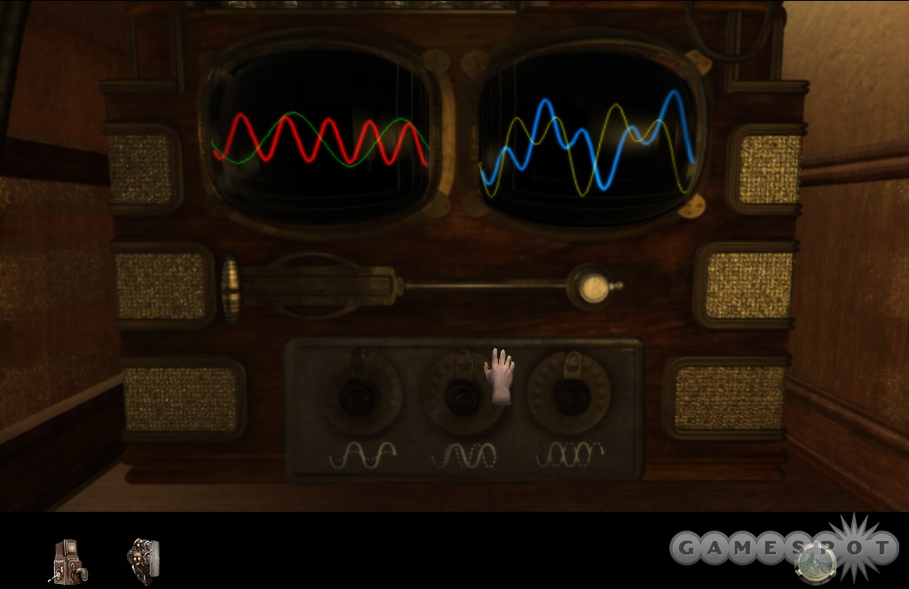

# Waves

Draw sine waves with the use of draggable sliders.

A primary wave is drawn as the summation of each line added to the page.

To use, click "CREATE WAVE," then drag the sliders to change the wave shape.

The project can be found on [codepen.io](https://codepen.io/aholmes/full/gBNbKN)!

Here's what the app looks like with a few waves:

This project was inspired by the "wave puzzle" in Myst IV: Revelation.

(Image credit [gamespot.com](https://www.gamespot.com/articles/myst-iv-revelation-final-impressions/1100-6108695/)).